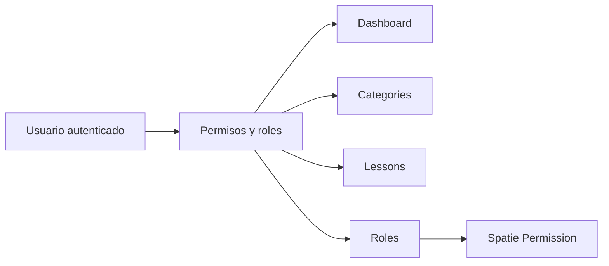

<div align="center">

# SpeakSmarter

Plataforma web para organizar contenido educativo con lecciones, categorias y control de acceso por roles.

[](#stack)
[](#stack)
[](#stack)
[](#stack)
[](#stack)
[](#licencia)
[](#estado-del-proyecto)

`Laravel` `Jetstream` `Sanctum` `Spatie Permission` `Inertia` `Vue` `Tailwind`

[Instalacion](#instalacion) | [Modulos](#modulos-actuales) | [Roles](#matriz-de-acceso) | [Credenciales demo](#credenciales-demo) | [Pruebas](#pruebas)

</div>

---

## Resumen

SpeakSmarter centraliza la gestion de contenido educativo en una interfaz moderna y minimalista. Hoy el proyecto ya permite:

- visualizar un dashboard con contexto operativo
- administrar categorias
- administrar lecciones
- administrar roles y permisos
- restringir acceso segun el perfil del usuario

La app esta pensada para equipos que necesitan una base clara para crecer desde un panel administrativo simple hacia una plataforma educativa mas completa.

## Vista general

| Area | Estado | Que resuelve |
| --- | --- | --- |
| Dashboard | `Activo` | Resume metricas, progreso y contenido reciente |
| Categories | `Activo` | Organiza el mapa tematico del contenido |
| Lessons | `Activo` | Gestiona lecciones, niveles, recursos y categorias |
| Roles | `Activo` | Define permisos y acceso por perfil |
| Access Matrix | `Activo` | Separa permisos entre `admin`, `editor` y `client` |

## Stack

| Capa | Tecnologia |
| --- | --- |
| Backend | PHP 8.2+, Laravel 12 |
| Auth | Laravel Jetstream, Laravel Sanctum |
| Permisos | Spatie Laravel Permission |
| Frontend | Vue 3, Inertia.js 2 |
| Build | Vite 7 |
| UI | Tailwind CSS |
| Base de datos | MySQL o MariaDB |

## Modulos actuales

### Dashboard

- metricas de contenido
- checklist operativo
- lecciones recientes
- categorias recientes
- resumen visual del avance del sistema

### Categories

- listado paginado
- creacion
- edicion
- eliminacion
- conteo de lecciones por categoria

### Lessons

- listado paginado
- creacion
- edicion
- eliminacion
- asignacion de nivel
- asignacion multiple de categorias
- soporte para `image_uri`, `content_uri` y `pdf_uri`
- bandera `is_free`

### Roles

- listado de roles
- creacion de roles
- edicion de roles
- seleccion de permisos por modulo
- conteo de usuarios asignados por rol

## Matriz de acceso

| Rol | Categories | Lessons | Roles |
| --- | --- | --- | --- |
| `admin` | acceso total | acceso total | acceso total |
| `editor` | acceso completo | crear, leer, editar y actualizar | sin acceso |
| `client` | solo lectura | solo lectura | sin acceso |

### Reglas importantes

- todas las rutas administrativas estan protegidas por autenticacion
- los permisos se validan del lado servidor
- la interfaz tambien oculta acciones segun permisos compartidos por Inertia

## Flujo general



## Instalacion

### Requisitos

- PHP 8.2 o superior
- Composer
- Node.js 18 o superior
- npm
- MySQL o MariaDB

### Paso a paso

1. Clona el repositorio.

```bash
git clone <url-del-repositorio>
cd SpeakSmarter
```

2. Instala dependencias de backend.

```bash
composer install
```

3. Instala dependencias de frontend.

```bash
npm install
```

4. Crea el archivo `.env`.

Linux o macOS:

```bash
cp .env.example .env
```

Windows PowerShell:

```powershell
Copy-Item .env.example .env
```

5. Genera la clave de la aplicacion.

```bash
php artisan key:generate
```

6. Configura la base de datos en `.env`.

```env
DB_CONNECTION=mysql
DB_HOST=127.0.0.1
DB_PORT=3306
DB_DATABASE=speaksmarter
DB_USERNAME=root
DB_PASSWORD=
```

7. Ejecuta migraciones y seeders.

```bash
php artisan migrate:fresh --seed
```

8. Inicia el entorno de desarrollo.

Opcion rapida:

```bash
composer run dev
```

Ese comando inicia:

- servidor Laravel
- cola
- visor de logs con Pail
- Vite en modo desarrollo

Opcion manual:

```bash
php artisan serve
```

```bash
npm run dev
```

## Seeders incluidos

La carga inicial del proyecto incluye:

- `LevelSeeder`
- `RoleSeeder`
- `UserSeeder`

### Niveles creados

| Nivel |
| --- |
| `A1` |
| `A2` |
| `B1` |
| `B2` |
| `C1` |
| `C2` |

## Credenciales demo

Estas cuentas se crean automaticamente con `php artisan migrate:fresh --seed`.

| Rol | Correo | Contrasena |
| --- | --- | --- |
| Admin | `admin@speaksmarter.com` | `admin1234` |
| Editor | `editor@speaksmarter.com` | `editor1234` |
| Client | `client@speaksmarter.com` | `client1234` |

## Scripts utiles

| Comando | Descripcion |
| --- | --- |
| `composer run dev` | Levanta server, queue, logs y vite |
| `composer run test` | Limpia config y ejecuta pruebas |
| `php artisan test` | Ejecuta la suite de pruebas |
| `php artisan migrate:fresh --seed` | Reconstruye la base de datos con datos iniciales |
| `npm run dev` | Inicia Vite en desarrollo |
| `npm run build` | Genera build de produccion |

## Pruebas

El proyecto incluye cobertura automatizada para:

- autenticacion base de Jetstream
- gestion de categorias
- gestion de lecciones
- gestion de roles
- matriz de acceso por rol

Archivos clave:

- `tests/Feature/AccessMatrixTest.php`
- `tests/Feature/CategoryManagementTest.php`
- `tests/Feature/LessonManagementTest.php`
- `tests/Feature/RoleManagementTest.php`

## Rutas principales

| Ruta | Descripcion |
| --- | --- |
| `/` | pagina publica de bienvenida |
| `/dashboard` | panel principal autenticado |
| `/categories` | gestion de categorias |
| `/lessons` | gestion de lecciones |
| `/roles` | gestion de roles |

## Estructura relevante

```text
app/
  Http/
    Controllers/
    Middleware/
    Requests/
database/
  migrations/
  seeders/
resources/
  css/
  js/
    Common/
    Components/
    Layouts/
    Pages/
routes/
tests/
```

## Roadmap

- [x] Dashboard visual
- [x] CRUD de categorias
- [x] CRUD de lecciones
- [x] CRUD de roles
- [x] Matriz de acceso por permisos
- [ ] Modulo de cursos
- [ ] Mejoras para carga de archivos
- [ ] Vista publica o experiencia para estudiantes
- [ ] Documentacion de despliegue

## Estado del proyecto

SpeakSmarter ya tiene una base funcional para administrar contenido y accesos. El foco actual esta en consolidar la experiencia administrativa y seguir ampliando la plataforma educativa sobre una estructura ya probada.

## Autor

Desarrollado por Luis Diaz.

## Licencia

Este proyecto se distribuye bajo licencia MIT.
